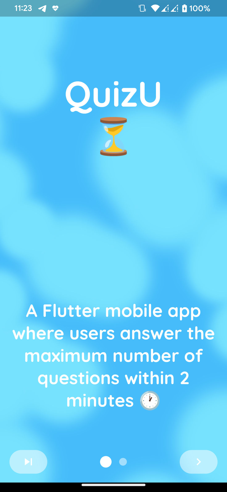
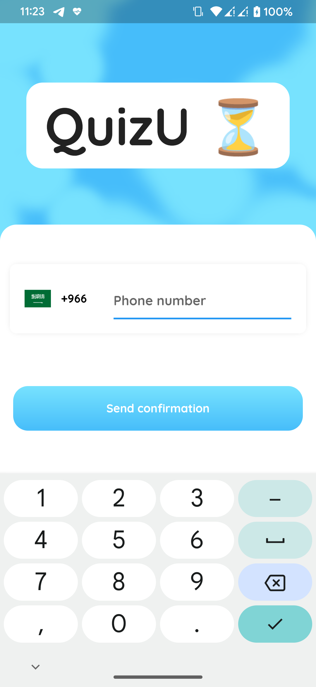
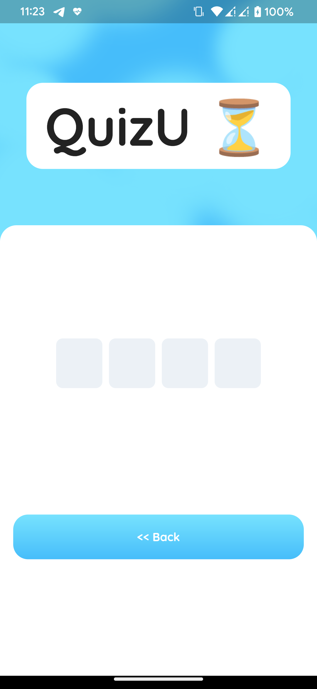
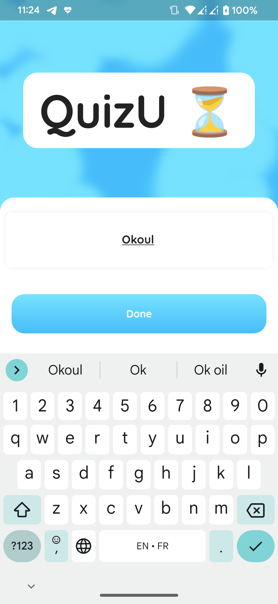
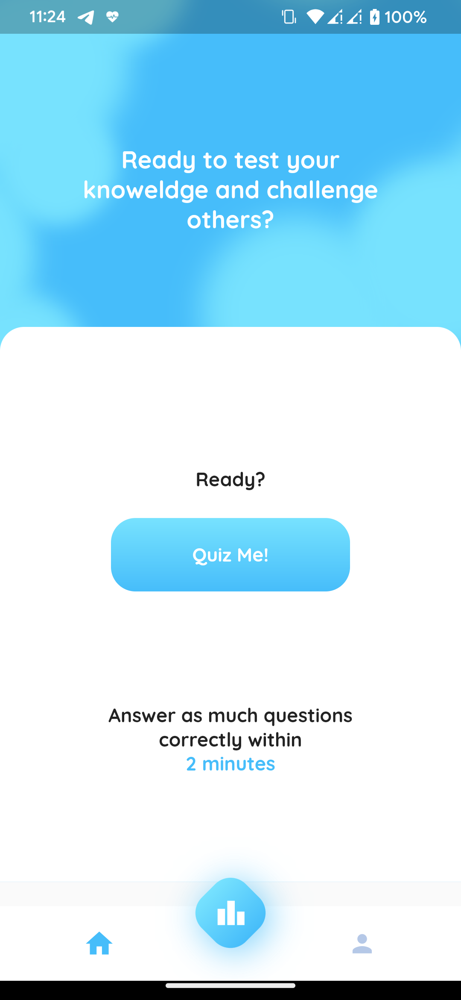
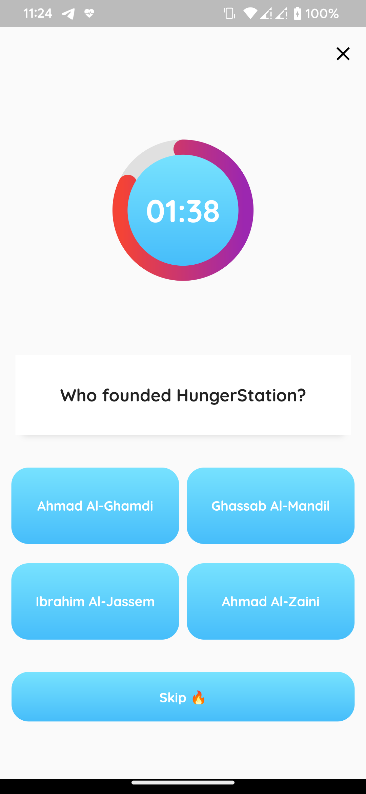
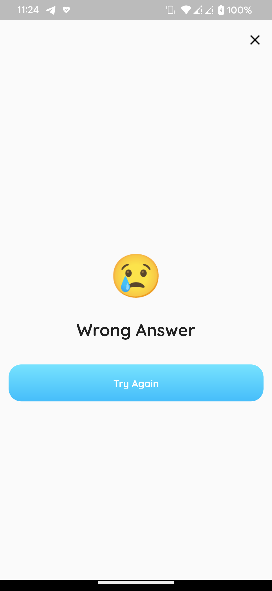
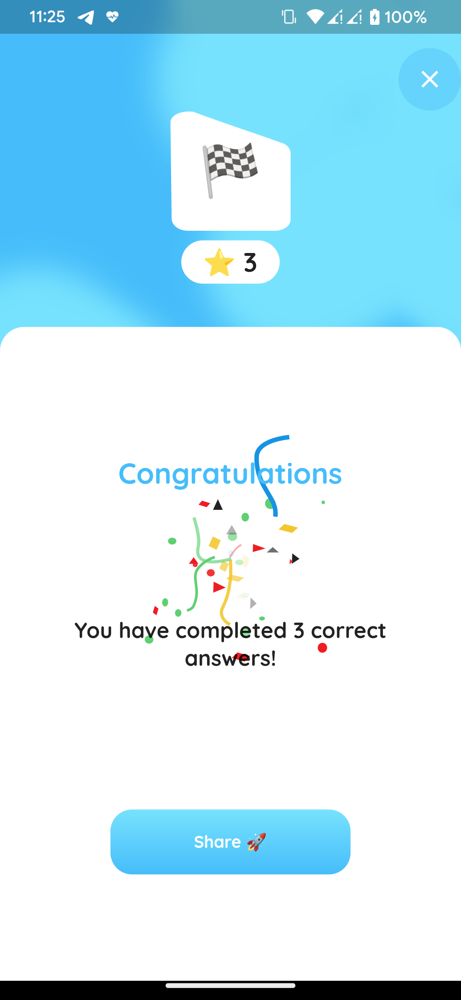
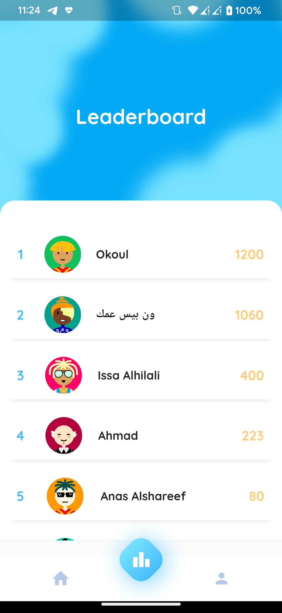
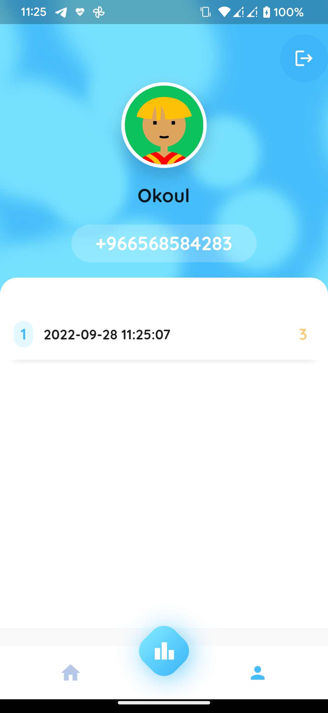

# QuizU [Try Now!](https://github.com/ramzieus/QuizU/releases/tag/v1.0.0)

## Packages Used 
- [intl_phone_number_input](https://pub.dev/packages/intl_phone_number_input)
- [dio](https://pub.dev/packages/dio)
- [pinput](https://pub.dev/packages/pinput)
- [shared_preferences](https://pub.dev/packages/shared_preferences)
- [animate_do](https://pub.dev/packages/animate_do)
- [circular_countdown_timer](https://pub.dev/packages/circular_countdown_timer)
- [share_plus](https://pub.dev/packages/share_plus)
- [path_provider](https://pub.dev/packages/path_provider)
- [random_avatar](https://pub.dev/packages/random_avatar)
- [intro_slider](https://pub.dev/packages/intro_slider)
- [diamond_bottom_bar](https://pub.dev/packages/diamond_bottom_bar)
- [simple_animations](https://pub.dev/packages/simple_animations)
- [google_fonts](https://pub.dev/packages/google_fonts)
- [lottie](https://pub.dev/packages/lottie)
- [path](https://pub.dev/packages/path)
- [flutter_svg](https://pub.dev/packages/flutter_svg)

## UI inspiration
[Cizo - Quiz App UI KIt](https://dribbble.com/shots/15173744-Cizo-Quiz-App-UI-KIt)

fonts :
- Google Fonts
- imoji

Animation:
- Lottie [Thanos Koutsoupas](https://lottiefiles.com/112854-congratulations)

## 
## Screenshots

| Intro | Login | OTP |
| :---:         |     :---:      |          :---: |
|    |      |     |
| Name     | Home       | Quiz      |
||| |
|Wrong|Congratulations|Leaderboard|
||||
|Profile|
||

## Technical Requirements
NOTE: Here is the API documentation

### Token
The app checks if the token is valid on app launch. If so, home screen is shown
GET https://quizu.okoul.com/Token
if token is invalid or non-existent, login screen is shown.

### Login
When the user clicks “Start” there is no call to the server, the call is done after “Check” is clicked on next screen
correct OTP is always 0000 but should still be checked at server using the call below
POST https://quizu.okoul.com/Login
Returns:
1- Bearer token
1- Status, either new or returning, if returning also returns Name, Mobile
*Please use this library to validate the mobile number:
https://pub.dev/packages/phone_number
*Client-side validation should be done to check if mobile or OTP is empty and an error message is shown accordingly

### Name
If the user is new, the name input screen is shown, when done is clicked the name is updated in the server
POST https://quizu.okoul.com/Name
Returns:
1- Name
2- Mobile
*Client-side validation should be done to check if Name is empty and an error message is shown accordingly
Leaderboard
Top 10 scores (names and count of correct answers are retrieved from server) and displayed sorted descending by count of correct answers
GET https://quizu.okoul.com/TopScores

### Profile
Name and mobile are displayed
previous scores for the logged-in users is shown from local storage, sorted by date descending
If the logout button is clicked the token is deleted form local storage, no server call is made
If at anytime, you would like to get the user’s info, please call GET https://quizu.okoul.com/UserInfo (make sure your token is valid)
Returns:
1-Name
2-Mobile

### Quiz
When the quiz is started, GET https://quizu.okoul.com/Questions is called returns 30 questions with their answers Returns:
{question, option 1, option 2, option 3, options 4, correct option: X}
Score
When the quiz is completed correctly the score is saved to server
POST https://quizu.okoul.com/Score
Also save the score locally on local storage to be used in Profile tab

